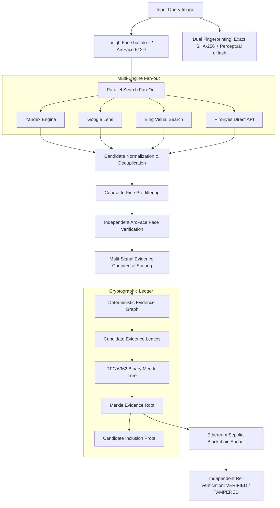

# TraceFace

> **TraceFace is a provenance-first face discovery pipeline that turns web search results into a cryptographically verifiable evidence graph, anchored on-chain through a deterministic Merkle commitment.**

**HH Goa 2026 — Task 3: Face Discovery, Evidence Fusion & Cryptographic Ledger**

Most face search pipelines simply find a matching candidate and push an arbitrary hash to a blockchain. TraceFace preserves the complete chain of investigative provenance: concurrent multi-engine discovery, provider corroboration, candidate normalization, independent multi-face ArcFace verification, explainable multi-signal confidence scoring, and a deterministic Merkle Evidence Tree anchored to Ethereum Sepolia.

```text
               1. Multi-engine parallel discovery
                               ↓
               2. Evidence graph + explainable confidence
                               ↓
               3. Merkle-root blockchain integrity + live tamper test
```

---

## Technical Pipeline



---

## Discovered Post & Blockchain Commitment Flow

The hackathon requires recording the discovered post or its cryptographic fingerprint to the blockchain. TraceFace fulfills this through a hierarchical cryptographic commitment:

```text
Matched post
     ↓
SHA-256 / perceptual fingerprint
     ↓
evidence leaf
     ↓
Merkle root
     ↓
Ethereum Sepolia
     ↓
on-chain verification
```

> **"The matched post's cryptographic fingerprint is explicitly included as a committed evidence leaf; Ethereum Sepolia anchors the Merkle root representing the complete evidence set."**

The smart contract record locks:
- **Merkle Root**: Cryptographic commitment over all candidates and search provenance.
- **Matched Post URL**: Canonical URL of the discovered web/social post.
- **Matched Post Fingerprint**: Exact SHA-256 and perceptual dHash of the matched image.
- **Investigation Metadata**: Scores, timestamps, and model identifiers.

---

## Architecture Highlights

- **Parallel Multi-Engine Discovery**: Designed for concurrent provider execution across Yandex, Google, Bing, and PimEyes (`asyncio.gather`) with independent per-engine timeouts and failure isolation.
- **Result Normalization & Deduplication**: Canonical URL parsing, query tracking parameter removal (`utm_*`, `fbclid`, `ref`), and multi-provider agreement tracking (`"providers": ["google", "yandex"]`).
- **Coarse-to-Fine Processing**: Designed for efficient candidate pre-filtering (payload validation, minimum dimensions, extreme aspect ratio rejection) before running deep 512D ArcFace embeddings.
- **Multi-Signal Evidence Confidence**: Transparent 0–100 score combining ArcFace cosine similarity (45 pts), runner-up margin (20 pts), provider agreement (15 pts), platform authenticity (10 pts), and image fidelity (10 pts).
- **Deterministic Merkle Tree**: RFC 6962 domain separation (`0x00` leaf, `0x01` internal node), deterministic sorting, and duplicate-last odd node handling.
- **Cryptographic Inclusion Proofs**: Proves mathematically that a specific candidate was part of the evidence set committed on-chain.
- **Zero-Dependency Perceptual Fingerprint**: Built-in 64-bit difference hash (`dhash-64`) to confirm visual equivalence alongside exact SHA-256 byte integrity.

---

## Installation & Setup

### 1. Prerequisites
- Python 3.10+
- Linux (x86_64 / aarch64) or macOS

### 2. Virtual Environment Setup
```bash
# Clone repository
git clone https://github.com/vanrajsinh650/TraceFace.git
cd TraceFace

# Create and activate virtual environment
python -m venv .venv
source .venv/bin/activate

# Install dependencies
pip install -r requirements.txt
```

### 3. Environment Variables (.env)
Copy `.env.example` to `.env`:
```bash
cp .env.example .env
```

Configure `.env`:
```ini
# Ethereum Sepolia Testnet (Chain ID: 11155111)
SEPOLIA_RPC_URL=https://ethereum-sepolia-rpc.publicnode.com
PRIVATE_KEY=your_private_key_without_0x_prefix
CONTRACT_ADDRESS=your_deployed_contract_address

# Optional: PimEyes session cookies (alternative to pimeyes_cookies.json)
PIMEYES_EMAIL=your_pimeyes_email
PIMEYES_PASSWORD=your_pimeyes_password

# Optional: Cosine similarity threshold override (default: 0.35)
SIMILARITY_THRESHOLD=0.35
```

---

## CLI Commands

### 1. Run Discovery & Evidence Anchoring Pipeline
```bash
# Run full pipeline with live blockchain anchoring
python main.py --image path/to/face.jpg

# Run pipeline in offline mode (local Merkle ledger, no testnet gas needed)
python main.py --image path/to/face.jpg --no-blockchain
```

### 2. Cryptographic Re-Verification
Independently recomputes all SHA-256 hashes, canonical JSON, and Merkle tree roots from local evidence, verifying against on-chain records:
```bash
python main.py verify results/evidence_<hash>.json
```

### 3. Live Tamper Demonstration
Demonstrates that TraceFace detects any controlled tampering (e.g. modified similarity score, altered URL, or tampered metadata):
```bash
python main.py tamper-demo results/evidence_<hash>.json
```

### 4. Merkle Inclusion Proof Inspection
Displays and mathematically verifies the audit path locking the matched candidate into the Merkle Root:
```bash
python main.py proof results/evidence_<hash>.json
```

> **Note on Evidence Files**: Generated evidence JSON files in `results/` are intentionally gitignored to prevent committing investigation artifacts, raw images, or session data to source control. Run the pipeline (`python main.py --image test_face.jpg`) to generate `results/evidence_<hash>.json`, which can then be tested with `verify`, `tamper-demo`, and `proof`.

---

## Live Demo & Screen Recording Script

For a 2-minute video presentation:

1. **Start Discovery & Anchoring Pipeline**:
   ```bash
   python main.py --image test_face.jpg --max-candidates 3
   ```
   *Points to highlight*:
   - Face detected with buffalo_l, 512D ArcFace vector extracted.
   - Exact SHA-256 + Perceptual dHash generated.
   - Parallel multi-engine search runs across Yandex, Google, Bing with failure isolation.
   - Candidate on public platform verified with high similarity (0.7258 >= 0.35).
   - Multi-signal evidence confidence score calculated: **81.0/100 (VERY_STRONG)**.
   - Merkle Evidence Root computed locking all candidates and investigation state.
   - Real transaction broadcast to Ethereum Sepolia and confirmed on-chain.

2. **Verify Cryptographic Commitment & On-Chain Root**:
   ```bash
   python main.py verify results/evidence_475a7d04d37f.json
   ```
   *Shows*:
   - Local Merkle tree recomputed from raw candidate items.
   - On-chain root verified against Ethereum Sepolia smart contract.
   - Result: `✅ VERIFIED`.

3. **Demonstrate Tamper Resistance**:
   ```bash
   python main.py tamper-demo results/evidence_475a7d04d37f.json
   ```
   *Shows*:
   - Phase 1: Untouched original -> `✅ VERIFIED`.
   - Phase 2: Controlled modification in memory -> `❌ TAMPERED` with exact leaf and root mismatch diagnostics.
   - Phase 3: Original file re-verified -> `✅ VERIFIED (File is completely intact)`.

4. **Verify Merkle Inclusion Proof**:
   ```bash
   python main.py proof results/evidence_475a7d04d37f.json
   ```
   *Shows*:
   - Step-by-step cryptographic audit path.
   - Result: `✅ INCLUSION PROVEN: Candidate is mathematically locked into the Merkle Root`.

---

## Example Output

```text
TraceFace — Cryptographic Face Discovery & Evidence Ledger
Investigation: inv_20260904_163445_47f682e9
Input image:   test_face.jpg (125 KB)

[1/7] Detecting face and computing ArcFace embedding...
  ✓ Detected 6 face(s) in 4424 ms
  ✓ Primary face bbox: (903, 62, 1013, 205) (conf: 0.871)
  ✓ Embedding: 512-dim ArcFace unit vector
  ✓ Exact SHA-256: 47f682e945b659f93a9e...
  ✓ Perceptual dHash: 8e87a44c69130f0f (alg: dhash-64)

[2/7] Executing parallel multi-engine reverse search...
      yandex     [✓] success  (20 matches, 4635 ms)
      google     [○] empty    (0 matches, 1634 ms)
      bing       [✗] error    (0 matches, 3759 ms)
      pimeyes    [✗] skipped  (0 matches, 0 ms)
  ✓ Discovered 20 unique candidates across engines

[3/7] Normalizing, deduplicating, and coarse-filtering candidates...

[4/7] Independent face verification across top 3 candidates...
  ✓ candidate_02 [yandex] fb.ru: MATCH (score 0.7258 >= 0.35)
      candidate_03 [yandex] fb.ru: MATCH (secondary) (score 0.7354)
      candidate_01 [yandex] danielaityroblox.serv00.net: MATCH (secondary) (score 0.6612)

[5/7] Fusing evidence, computing confidence score, and building provenance graph...
  ✓ Evidence confidence: 81.0/100 (VERY_STRONG)
      • face_similarity     : 43.5/45 pts [High match]
      • runner_up_margin    : 18.0/20 pts [Single isolated face in candidate image]
      • provider_agreement  :  6.0/15 pts [Discovered by 1 engine (yandex)]
      • source_quality      :  6.5/10 pts [Public web domain (fb.ru)]
      • image_fidelity      :  7.0/10 pts [Standard candidate image]
  ✓ Evidence graph built: 16 nodes, 19 edges

[6/7] Constructing deterministic Merkle Evidence Tree...
  ✓ Merkle Evidence Root: 819f41a2ee8f12df5a283fd3fb8804c99bfe4155f6b8f4ce9f572a6675b7ea4e
  ✓ Merkle Tree leaves:   4
  ✓ Evidence SHA-256:     475a7d04d37fdb65747853f90176d9b72fbdda07f0975412c6b899e84b7d5bea
  ✓ Merkle Inclusion Proof verified for candidate_02 (path depth: 2)
  ✓ Evidence package persisted: results/evidence_475a7d04d37f.json

[7/7] Anchoring Merkle Root & Discovered Post Fingerprint to Ethereum Sepolia...
  • Matched Post URL:    https://fb.ru/post/movies/2015/11/2/2589
  • Post Image SHA-256:  a47948ca0fa12bf2c175fdea5450d861f87116f5f6d1929e5989c3cd3b964e5e
  • Post Image dHash:    8e87a44c69530f2f
  • Evidence Leaf ID:    candidate_02 (locked inside Merkle Root)
  • Committed Root:      819f41a2ee8f12df5a283fd3fb8804c99bfe4155f6b8f4ce9f572a6675b7ea4e
  ✓ Deployer Wallet:     0x0Ab3609B9538e752EF00Fa3747389daA466A9F9c
  ✓ Transaction:         0xa29aeb47ec064f5d5981532f981d3081014e1c65bc76a092c659511594f38ad8
  ✓ Confirmed in block:  11639100
  ✓ Explorer:            https://sepolia.etherscan.io/tx/a29aeb47ec064f5d5981532f981d3081014e1c65bc76a092c659511594f38ad8
  ✓ On-chain root:       0x819f41a2ee8f12df5a283fd3fb8804c99bfe4155f6b8f4ce9f572a6675b7ea4e
  ✓ Blockchain verify:   VERIFIED

──────────────────────────────────────────────────────────────────
  STAGE PERFORMANCE & LATENCY OBSERVABILITY (MEASURED)
──────────────────────────────────────────────────────────────────
  Face Detection:           3987 ms
  Multi-Engine Search:      6360 ms
  Candidate Verification:  15783 ms
  Evidence Graph:              0 ms
  Merkle Tree Build:          10 ms
  Blockchain Anchor/Check: 21332 ms
  Total Pipeline Latency:  47502 ms
──────────────────────────────────────────────────────────────────
```

---

## Smart Contract Details

- **Contract**: `contracts/EvidenceStorage.sol`
- **Network**: Ethereum Sepolia Testnet (Chain ID: 11155111)
- **Explorer**: [sepolia.etherscan.io](https://sepolia.etherscan.io)
- **Deployed Address**: [`0x57306beBD4A3aFdec95b32fF39f9046aA338e8A2`](https://sepolia.etherscan.io/address/0x57306beBD4A3aFdec95b32fF39f9046aA338e8A2)
- **Deployment Tx**: [`0x2ebc9f69bb71a4d417d244faa51f11643a3199bb1f89355a0ed2b6321e846611`](https://sepolia.etherscan.io/tx/0x2ebc9f69bb71a4d417d244faa51f11643a3199bb1f89355a0ed2b6321e846611) (Block: 11639090)
- **TraceFace Anchor Tx**: [`0xa29aeb47ec064f5d5981532f981d3081014e1c65bc76a092c659511594f38ad8`](https://sepolia.etherscan.io/tx/0xa29aeb47ec064f5d5981532f981d3081014e1c65bc76a092c659511594f38ad8) (Block: 11639100)
- **Functions**:
  - `storeEvidence(string _fileHash, string _metadata)`: Commits the Merkle Root and JSON metadata.
  - `verifyHash(string _fileHash)`: Queries if a root exists on-chain and returns evidence ID.
  - `getEvidence(uint256 _evidenceId)`: Retrieves the anchored record.

To deploy a contract instance:
```bash
python deploy_contract.py
```

---

## Unit Testing

Run the deterministic test suite:
```bash
source .venv/bin/activate
python -m unittest discover -s tests -p "test_*.py" -v
```

All 21 tests pass with zero warnings, covering:
- Merkle tree determinism, odd-leaf counts, and single-leaf handling.
- Cryptographic inclusion proof verification and forged proof rejection.
- Dual fingerprinting (exact SHA-256 and perceptual dHash Hamming distance).
- Multi-signal evidence scoring calculations and breakdown reports.
- URL canonicalization and multi-engine deduplication.
- Evidence graph building and deterministic serialization.
- Re-verification and controlled tamper detection.

---

## Privacy, Security & Limitations

1. **Not Real-World Identity Certification**: Face embedding similarity measures mathematical feature distance between two images under specific lighting, pose, and resolution. It is not legal proof of personhood or real-world identity.
2. **Search Engine False Positives/Negatives**: Public search engines (Google, Yandex, Bing) rely on visual similarity indexes and web crawls which may include lookalikes, stock images, or irrelevant results.
3. **Integrity vs. Truth**: Anchoring a Merkle root to Ethereum Sepolia guarantees that the investigation evidence has not been tampered with since anchoring. It does **not** certify that the underlying online posts or claims are factually truthful.
4. **Credential Safety**: Private keys and API credentials must never be committed to source control. Use environment variables.
5. **Intended Use**: TraceFace is an academic/hackathon proof-of-concept for transparent digital evidence ledgers.

---

## Attribution & Licenses

TraceFace builds upon open-source foundations:
- **InsightFace**: Deep face analysis and ArcFace embeddings.
- **PicImageSearch**: Multi-engine reverse search interfaces.
- **eye_of_web** by Mehmet Yüksel Şekeroğlu — MIT License (InsightFace initialization & cosine similarity principles).
- **JARVIS** by affaan-m — Attribution maintained (PimEyes flow & reverse search orchestration).
- **blockchain-evidence** by Gooichand / EVID-DGC — Apache 2.0 (EvidenceStorage smart contract design).
- **RFC 6962**: Certificate Transparency specification for domain-separated binary Merkle trees.
